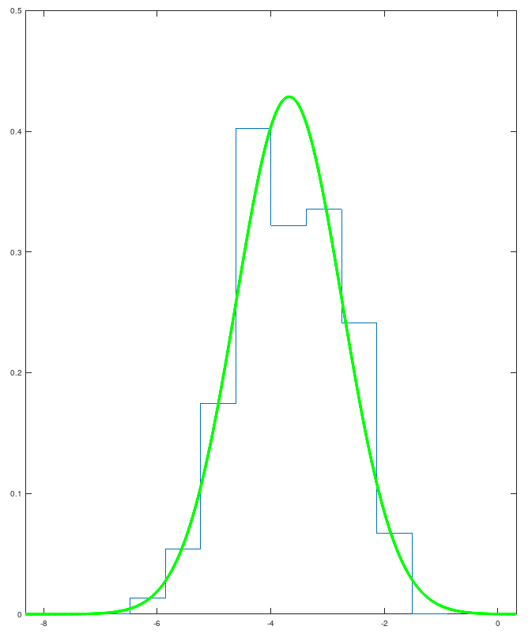

# Построение гистограммы и эмпирической функции распределения.

## Задание.
С заданием можно ознакомиться [здесь](../task/labs.pdf).

## Результат работы.
Для выборки из [варианта](./code/data.txt) были построены на одной координатной плоскости:

* гистограммы и графика функции плотности распределения вероятностей нормальной случайной величины с математическим
ожиданием $µ̂ $ дисперсией $S^2$.

* график эмпирической функции распределения и функции распределения нормальной случайной величины с математическим
ожиданием $µ̂ $ дисперсией $S^2$.

Более подробно с результатами работы можно ознакомиться в [отчете](../lab_01/report/report.pdf).