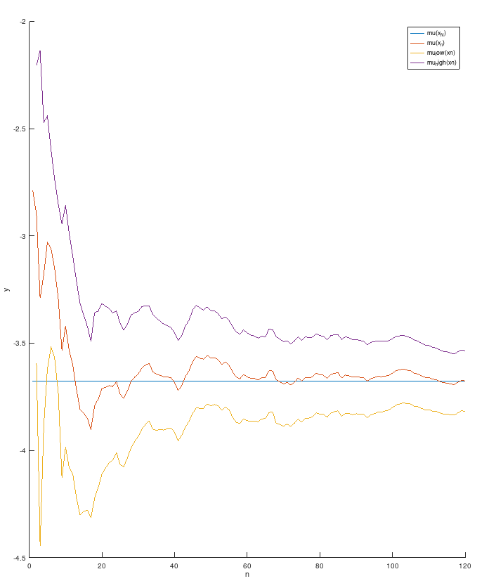
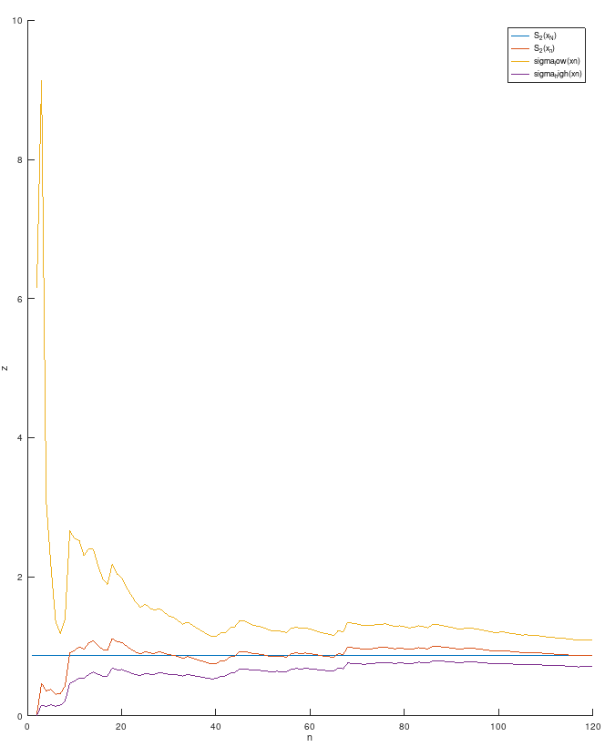

# Построение доверительных интервалов для математического ожидания и дисперсии нормальной случайной величины.

## Задание.
С заданием можно ознакомиться [здесь](../task/labs.pdf).

## Результаты работы.
Для заданного пользователем уровня доверия $γ$ и $N4 – объема выборки из [индивидуального
варианта](./code/data.txt):

а) на координатной плоскости $Oyn$ построить прямую $y = µ̂(\vec{x}_{N})$, также графики функций
$y = µ̂(\vec{x}_{n})$, $y = µ(\vec{x}_{n})$ и $y = µ(\vec{x}_{n})$ как функций объема $n$ выборки, где n изменяется от 1 до N;

б) на другой координатной плоскости Ozn построить прямую $z = S^2(\vec{x}_{N})$, также графики
функций $z = S^2(\vec{x}_{n})$, $z = σ^2(\vec{x}_{n})$ и $z = σ^2(\vec{x}_{n})$ как функций объема n выборки, где n изменяется от 1 до N.

(здесь есть кое-какие помарки с графиком возле нуля.)

Более подробно с результатами работы можно ознакомиться в [отчете](../lab_02/report/report.pdf).